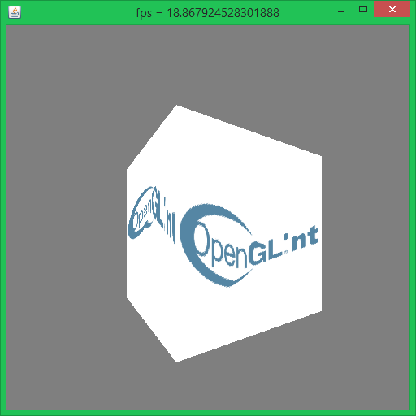

# OpenGL'nt

One afternoon fun project : Write a basic rasterizer !
This one is 'interesting' because I wanted to have programmable vertex/fragment shaders
in my crappy little software rendrer. "Shaders" are actually just two lambdas, a vertex lambda that
takes in a Vertex object (or a subclass), and outputs a IntermediaryData data object, and
a lambda called at every pixel, that takes an IntermediaryData and outputs a Vec4.

You can subclass both the Vertex and IntermediaryData classes and the additional vec2/3/4s you add will
get affine interpolation automagically (using the power of runtime-generated lists of lambdas)

## features

 * 512x512 awt window
 * clearing the screen
 * drawing colored 2d lines
 * drawing triangles with a miniature graphics pipeline
 * depth testing (dodgy math)
 * not opengl

## performance

it's shit

lambas use cases do not really include being called for every pixel of the window every frame.
still fun for prototyping and figuring out how everything fits in together

